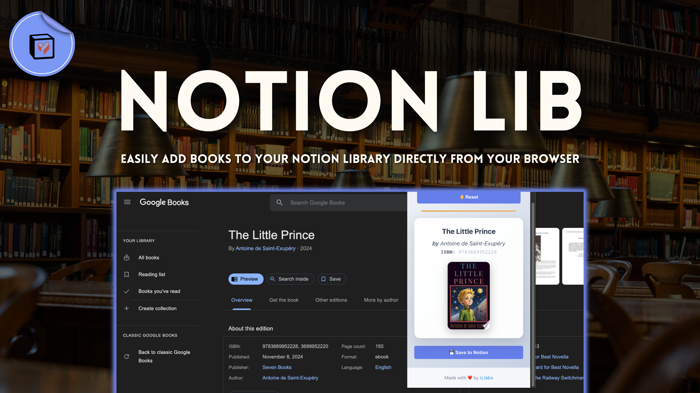
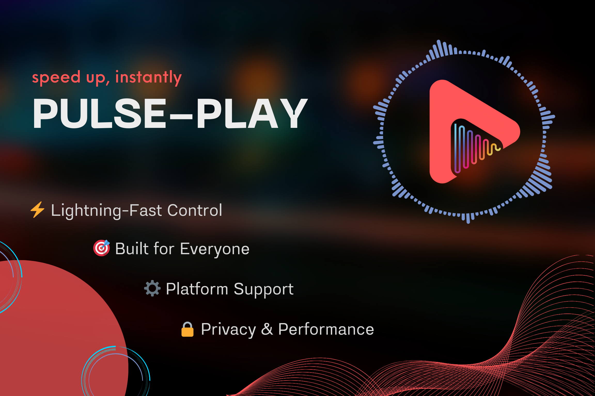
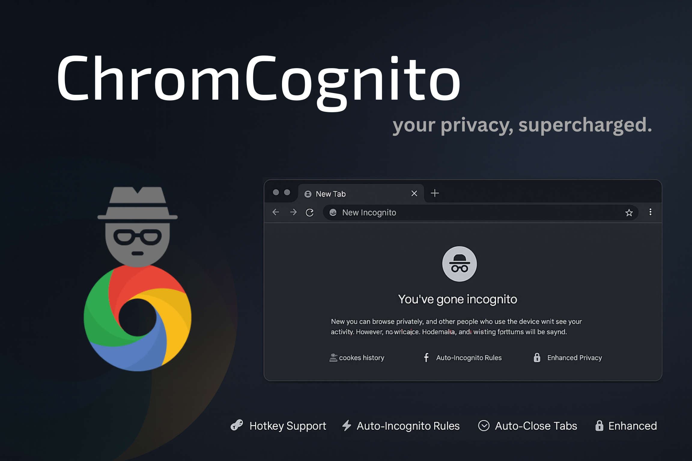
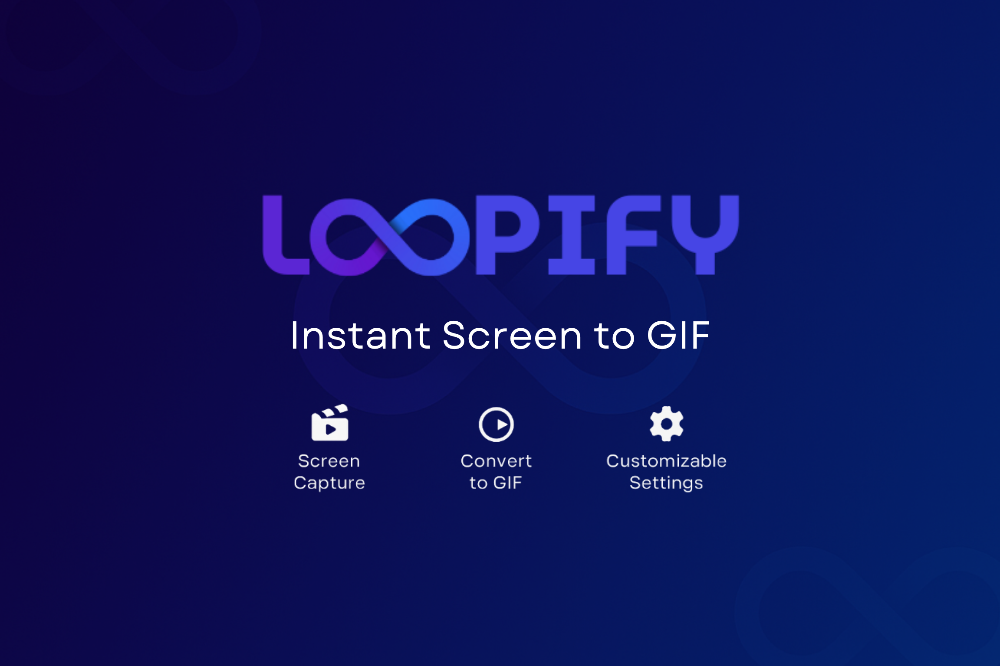
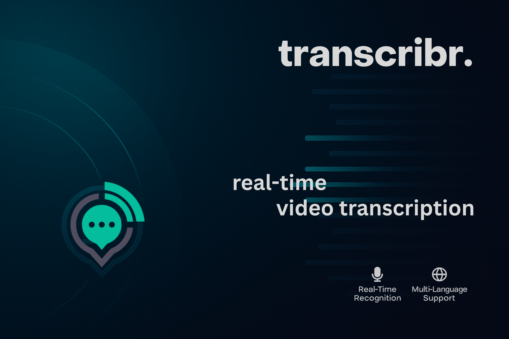
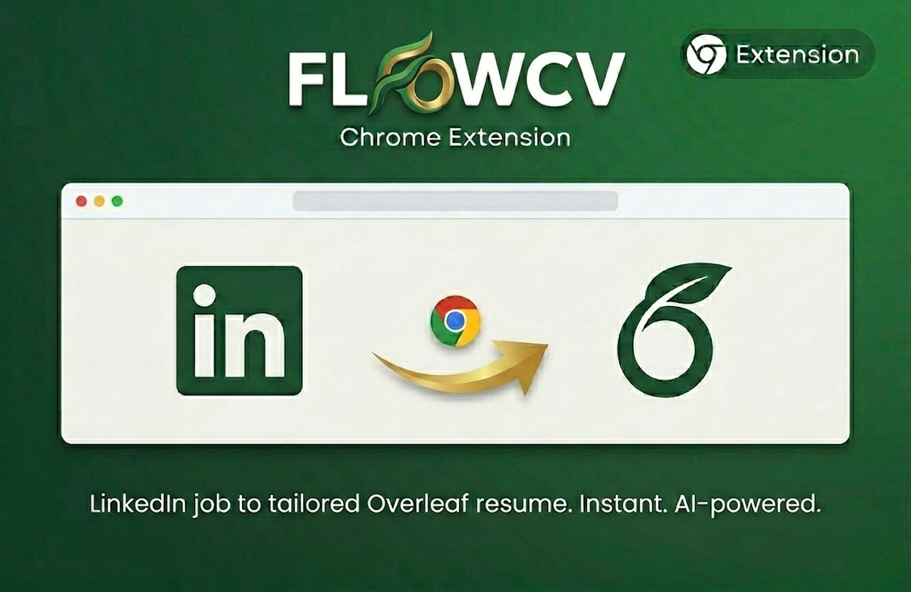

  
<strong>🚀 Clavo</strong>

   
 
   
  
  A Student-Powered Course-Review Platform for BCIT Students to share and browse honest feedback on every course.  
  
  

  ## 📝 Core Features
  - **Anonymous Reviews**  
    Share and browse honest feedback on BCIT CST courses without revealing your identity.
  - **Course Search & Filter**  
    Find courses by name and filter by difficulty, likes, or usefulness to explore what suits you best.
  - **Program-Powered Search**  
    Search for your program by keyword to quickly find matching courses and information.
  - **Clavo Community Q&A**  
    Ask and answer questions about courses, instructors, or programs to help and learn from others.
   

  
<strong>📋 ClipSign</strong>

   
  
  
    
  Generate, store, and instantly paste your personalized electronic signature anywhere via Raycast. 
  
  

   ## 📝 Core Features
  - **Upload Image**  
    Import a photo or scan of your handwritten signature to use as a base.
  - **Create Signatures**  
    Design new electronic signatures from custom text and a variety of fonts.
  - **Manage Signatures**  
    Organize your signature library—copy to clipboard or delete entries with ease.  
  
   

  
<strong>📚 Notion Lib</strong>

   
  
  
    
  Easily add books to your Notion library directly from your browser via this Chrome extension.
  
  

   ## 📖 Core Features
  - **Search Books**  
    Search for books and retrieve detailed information seamlessly.
  - **Add to Notion**  
    Instantly add selected books with details to your Notion library with one click.
  - **Manage API Keys**  
    Configure your Notion and Google Books API keys directly within the extension.  
  
   

  
<strong>🎬 Pulse Play</strong>

   
  
  
    
  Supercharge your video experience with Pulse Play. Hold a hotkey to instantly speed up videos — perfect for lectures, tutorials, or your favorite shows.
 
  

   ## ⚡ Core Features
  - **Hold-to-Boost**  
    Press & hold a hotkey to speed up instantly (just like shorts).
  - **Custom Speeds**  
    Adjust playback from 1.25x – 5x with full control.  
  - **Smart Detection**  
    Works seamlessly with YouTube, Netflix, Vimeo & any HTML5 player.  
  - **Visual Feedback**  
    On-screen speed indicator for clarity.  

   

  
<strong>🕵️‍♂️ ChromCognito</strong>

   

  
   
  Open links, tabs, and rules in Incognito with full control using this Chrome extension.
  
  

   ## 🕶️ Core Features
  - **Hotkey Support**  
    Open Incognito tabs instantly with customizable shortcuts.  
  - **Context Menu Actions**  
    Right-click any link and send it directly to Incognito.  
  - **Auto-Incognito Rules**  
    Define rules to always open specific sites in Incognito.   
  - **Privacy Enhancements**  
    Manage sessions without leaving history behind.  
  
   

  
<strong>🔄 Loopify</strong>

   

  
   
  Capture your screen and convert it instantly into GIFs with Loopify. Perfect for tutorials, demos, and sharing quick clips.  

  

   ## 🎬 Core Features
  - **Screen Capture**  
    Record your screen with adjustable frame rates.  
  - **GIF Conversion**  
    Convert screen recordings into smooth, optimized GIFs.  
  - **Quality Settings**  
    Balance quality and file size with flexible options.  
  - **Recent GIFs**  
    Quickly access and download your latest creations.  

   

  
<strong>📝 Transcribr</strong>

   

 

  Transcribr is a Chrome extension that captures audio from browser tabs and displays real-time transcriptions as a caption overlay, powered by Deepgram.

  

   ## 🎤 Core Features
  - **Real-Time Recognition**  
    Convert computer audio into live text.  
  - **Multi-Language Support**  
    Transcribe across languages and dialects.  
  - **Powered by Deepgram**  
    Voice AI APIs that Just Work.  
  - **Quick Access**  
    Press one button.

   

  
<strong>🍃 FlowCV </strong>

   

  FlowCV is a Chrome extension that tailors your Overleaf LaTeX resume to specific job descriptions using Claude AI, providing real-time edit suggestions directly within your editor.
  
  

   ## 🎤 Core Features
  - **One-Click Capture**  
    Extract job requirements directly from LinkedIn postings.
  - **AI-Powered Tailoring**  
    Leverage Claude AI to generate targeted resume optimizations.
  - **Word-Level Diffs**  
    Preview exact changes before applying them to your LaTeX code.
  - **Auto-Recompile**  
    Apply edits and see your updated PDF instantly in Overleaf.

   

  
<strong>📞 Geodial </strong>

   

  Geodial is a Chrome extension and web app for performance marketers to find and research available phone numbers by area code, city, or ZIP code.
  
  

   ## 🎤 Core Features
  - **Comprehensive US & Canada Lookup**  
    Toggle between US and Canada with support for states, provinces, ZIP codes, and postal codes. Enter any area code to see the country, state/province, and every city/town served. Conversely, search by city or ZIP/postal code to find all serving area codes.
  - **Available Number Search & Filtering**  
    Search for available Twilio phone numbers by area code, city + state, or ZIP code. Use built-in filters to exclude repeating digits or choppy patterns to find clean, professional numbers.
  - **Carrier Insights**  
    Each available number includes an integrated lookup, showing its underlying carrier.

   

  
<strong>👻 GhostPlayer </strong>

   

  Geodial is a Chrome extension that floats any **non-DRM** HTML5 video into a frameless, always-on-top overlay with a stealth **Hide Mode** — the video only plays and reveals itself when your cursor is inside the window.

  
  

   ## 🎤 Core Features
  - **One-click detach** - a ghost icon button appears when you hover over any `<video>` element on any page
  - **Zero-lag overlay** - the original video element is physically moved into the PiP window; no re-encoding or stream copying
  - **Hide Mode** - window goes black and video pauses when your cursor leaves; hover back in to instantly resume
  - **Minimal controls** - seek bar, play/pause, volume, playback speed (0.5×–2×)
  - **Keyboard shortcuts** - full keyboard control within the overlay window
  - **Non-intrusive injection** - button uses `position: fixed` so it never breaks the host page layout
  - **Dynamic detection** - `MutationObserver` catches videos added after page load (SPAs, lazy-loaded players)
  - **Non-DRM only** - works with any unencrypted HTML5 video; DRM-protected streams are not supported

   

  
<strong>☕ Support My Work</strong>

    

    

  Your support helps me dedicate more time to building meaningful solutions.

   
  
   

